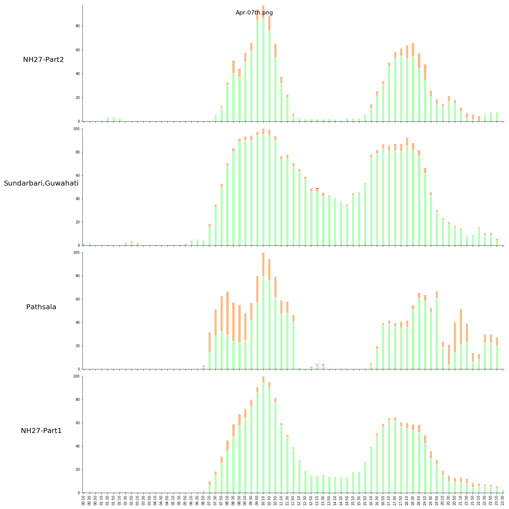
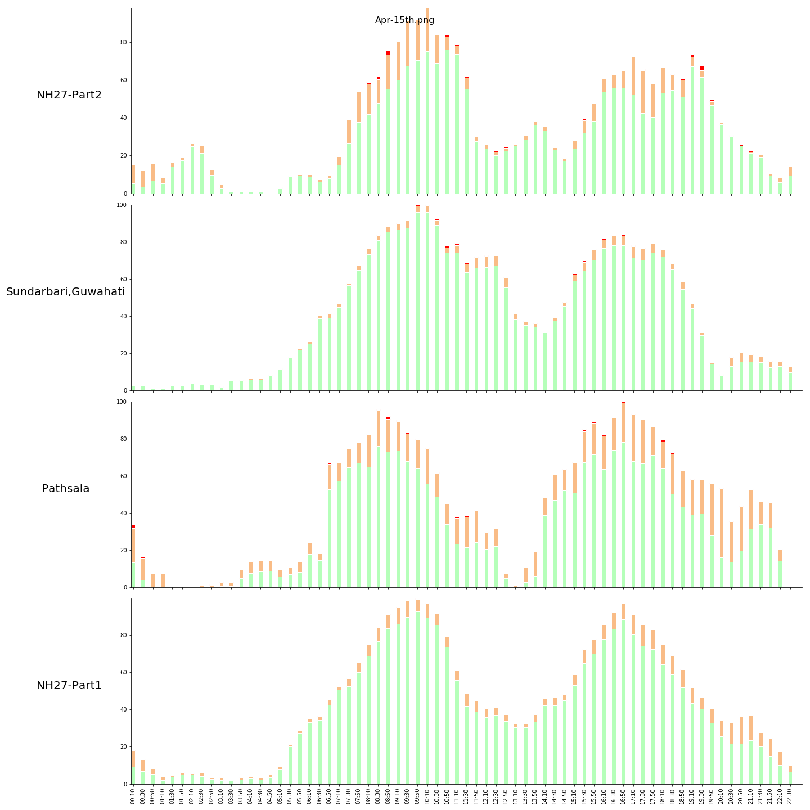

# Traffic-Tracker
Built for tracking traffic during CoVID-19 pandemic lockdown.

### What does it do?

Opens Google Maps, takes screenshots for every 5 mins and makes a GIF at the end. Timestamp is added on the top.

### How does it Work?

Selenium

### How should I change the location?

Go to Google Maps -> Browse to your location -> Select traffic layer --> Copy the _lat_,_long_,_zoom_ and paste it in `locations.json` and change `location` variable in `mapsgoogle.py`. That's it.

Traffic during lockdown-phase1

Traffic after lockdown-phase1 end date

